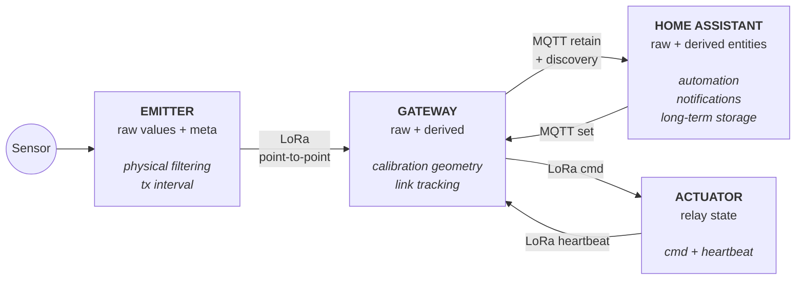
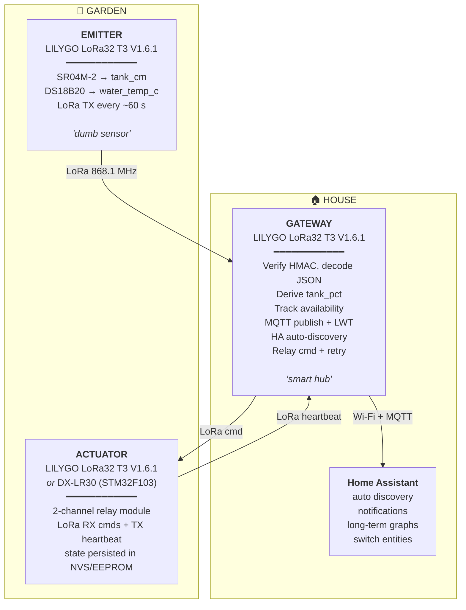
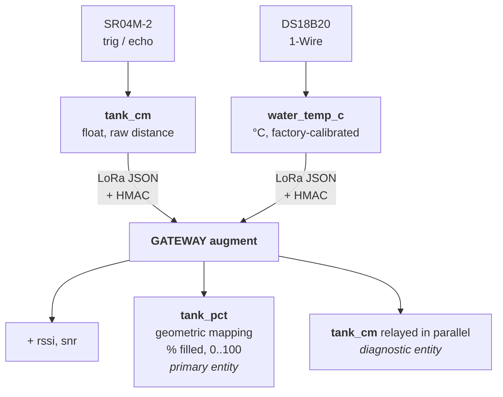
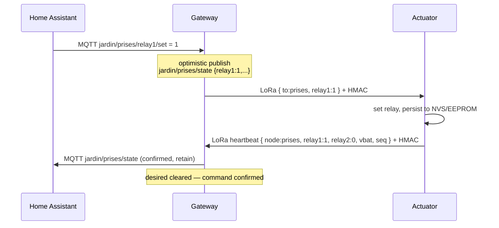
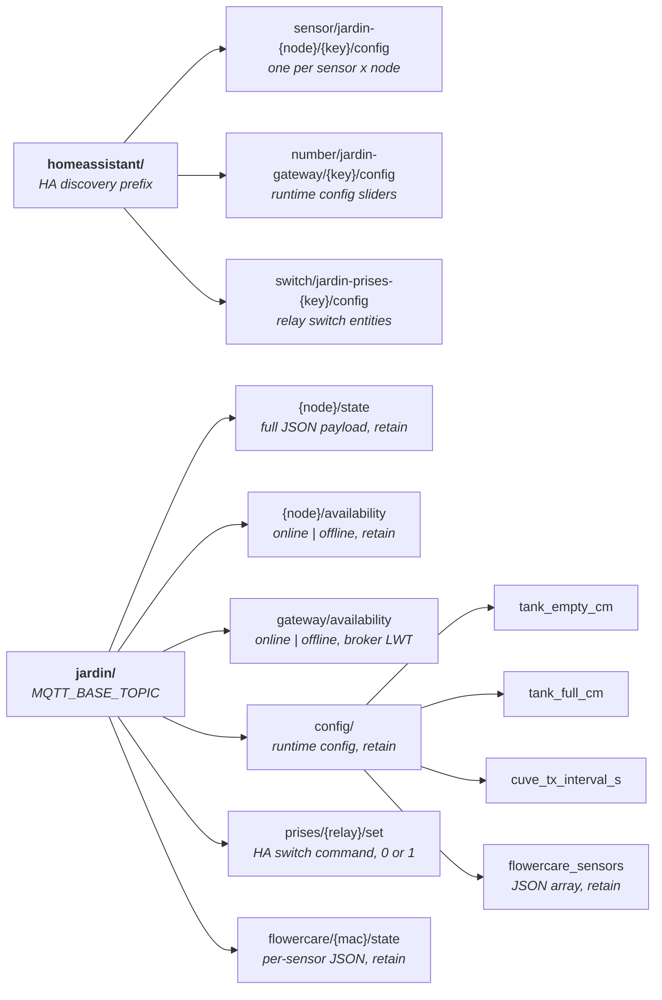
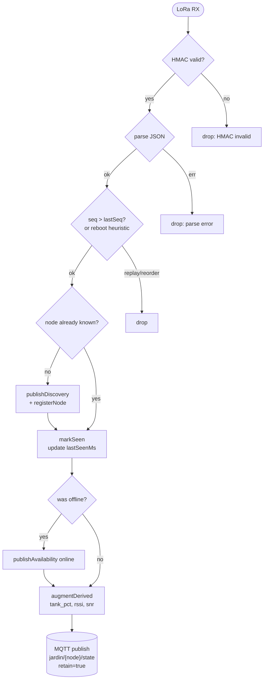
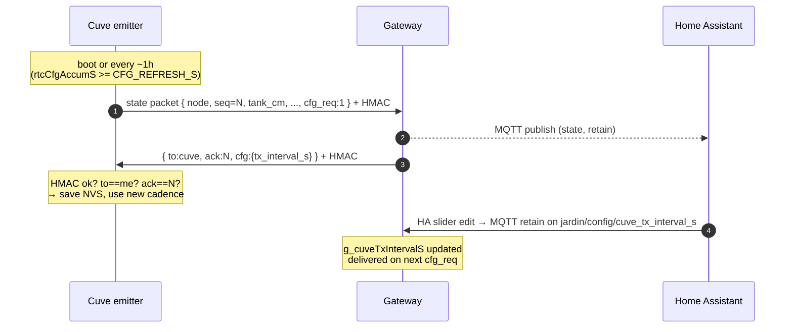

# Connected Garden Project – LoRa & Home Assistant

> **Status**: deployed, full LoRa + MQTT + HA + auth pipeline working end-to-end.
> **License**: [GPL v3](#license) · **Project**: personal

## Goal

Monitoring, alerting, and remote control for the garden:

- tank level reported via ultrasonic sensor
- "needs refill" notification
- **remote outlet control** (relay actuator) — switch garden sockets from HA
- **plant monitoring** via Flower Care BLE sensors (soil temp, moisture, light, conductivity)
- centralized integration into **Home Assistant**

## Constraints

- Distance house ↔ garden: ~100 m
- House Wi-Fi insufficient on the garden side → LoRa radio link
- Outdoor environment (humidity, interference, frost)
- **Mains** powered on both sides
- Reliability and simplicity required

## Philosophy: **emitter dumb, gateway smart**

Structural rule of the project, to follow for any new sensor added later.

- **The emitter** (garden side, in a waterproof box, hard to access) only
  does **raw measurement**: pin toggling, pulseIn, physical filtering
  (median). It serializes raw values into JSON and sends them over LoRa. No
  semantics, no calibration.
- **The gateway** (house side, accessible and reflashable) carries all the
  **semantic intelligence**: calibration, derivation of business values
  (`tank_pct`), enrichment (`rssi`, `snr`), MQTT publish and HA discovery.
- **Why**: recalibrating the tank or changing a threshold should never
  require opening the waterproof box in the garden.



## Overall architecture

The emitter and gateway run on the same board (LILYGO LoRa32 T3 V1.6.1).
The actuator has two firmware variants: the same LILYGO board
(`prises-actuator`) or a **DX-LR30** module (STM32F103 + SX1262,
`prises-actuator-dx-lr30`).



## Per-measurement data flow



## Relay actuator

A second LoRa node in the garden controls a **2-channel relay module** (garden
sockets). The gateway bridges HA switch commands to LoRa and tracks the
actuator's state.

### Command/heartbeat protocol



Properties:
- **Optimistic publish**: the gateway immediately updates `jardin/prises/state`
  when a command arrives from HA, without waiting for the LoRa round-trip.
  HA feels instant.
- **Confirmation**: when the actuator's heartbeat echoes the expected state,
  the desired state is cleared. If the heartbeat is missed (gateway was still
  in TX when the actuator responded), the gateway retransmits after
  `RELAY_CMD_RETRY_MS` (default 2500 ms).
- **Stale overlay**: if the heartbeat doesn't match the desired state (packet
  loss, collision), the gateway overlays the desired values before publishing
  so HA does not visually flip back. `g_relayCommandPending` triggers a
  retransmit.
- **Periodic heartbeat**: the actuator also sends a heartbeat every
  `TX_INTERVAL_S` seconds (default 60 s) so `rssi`/`vbat`/`snr` stay fresh
  in HA even with no commands.
- **State persistence**: relay state is saved to NVS (ESP32 `Preferences`) or
  EEPROM (STM32) on every change and restored at boot, so a power cycle keeps
  the last commanded state without any gateway intervention.
- **Restore on actuator reboot**: the first heartbeat after boot carries
  `restore_req:1`. The gateway responds by re-sending the last HA-commanded
  state according to the **Power-on behavior** setting (HA select entity,
  namespace `gw-sec`/`pob`): `previous` (default, re-apply last commanded
  state), `on` (force all relays on), `off` (force all-off for a safe restart),
  or `toggle` (invert current state, handled locally by the actuator).

### HA entities (actuator device "Prises")

| Entity | Type | MQTT topic | Notes |
|---|---|---|---|
| `Prise 1` | switch (primary) | `jardin/prises/relay1/set` | |
| `Prise 2` | switch (primary) | `jardin/prises/relay2/set` | |
| `Power-on behavior` | select (config) | `jardin/prises/power_on/set` | previous / on / off / toggle |
| `Battery voltage` | sensor (diagnostic) | `jardin/prises/state` → `vbat` | V |
| `LoRa RSSI` | sensor (diagnostic) | `jardin/prises/state` → `rssi` | dBm |
| `LoRa SNR` | sensor (diagnostic) | `jardin/prises/state` → `snr` | dB |

Availability: same mechanism as the emitter — `jardin/prises/availability`
goes `offline` after `NODE_TIMEOUT_MS` (3 min) without a heartbeat.

### Actuator JSON schema

Heartbeat payload on `jardin/prises/state` (after gateway augmentation):

```json
{ "node": "prises", "seq": 12, "relay1": 1, "relay2": 0, "vbat": 3.82,
  "rssi": -71, "snr": 8.5 }
```

Gateway command over LoRa (authenticated):

```
{"to":"prises","cs":42,"relay1":1,"power_on":"previous"}|<hmac16>
```

Fields: `cs` (monotonic command sequence for anti-replay), `relay1`/`relay2`
(0/1, only changed fields included), `power_on` (power-on behavior, echoed on
every command so the actuator stays in sync). Absent relay fields keep their
current state.

## JSON fields schema (cuve emitter)

| Field | Source | Type | Unit | HA category | Meaning |
|---|---|---|---|---|---|
| `node` | emitter | string | – | – | emitter identifier |
| `seq` | emitter | int | – | – | packet counter |
| `tank_cm` | emitter | float | cm | diagnostic | raw ultrasonic distance |
| `water_temp_c` | emitter | float | °C | primary | water temperature (DS18B20, factory-calibrated) |
| `fc` | emitter | array | – | – | Flower Care readings, one entry per MAC (see below) |
| `rssi` | gateway | int | dBm | diagnostic | LoRa reception quality |
| `snr` | gateway | float | dB | diagnostic | LoRa signal-to-noise ratio |
| `tank_pct` | **gateway derived** | int | % | primary | tank fill level |

> Note: `water_temp_c` is sent directly in °C by the emitter without gateway-side derivation. The DS18B20 is factory-calibrated to ±0.5 °C, no deployment-specific parameter. The "raw vs derived" rule applies to analog sensors or sensors that need deployment calibration (tank %).

The `fc` array contains one entry per configured MAC in order; `null` if the BLE read failed for that slot:

```json
"fc": [
  { "t": 22.5, "m": 45, "l": 1234, "c": 250, "b": 85 },
  null
]
```

| Key | Meaning | Unit |
|---|---|---|
| `t` | soil temperature | °C |
| `m` | soil moisture | % |
| `l` | light intensity | lux |
| `c` | soil conductivity | µS/cm |
| `b` | sensor battery | % |

## Tank geometry

The sensor is fixed under the tank cover, head facing down. It measures the
**distance between itself and the water surface** (`tank_cm`). The fuller
the tank, the smaller this distance.

```
   ┌──────────────────────┐  ◄── tank ceiling (cover with hole)
   │                      │
   │      ▼ SR04M-2       │  ◄── sensor head fixed to cover,
   │      ║║              │      measurement cone facing down
   │      ║║   ↓          │
   │      ║║   │          │
   │   acoustic wave      │
   │      │               │
   │      ▼               │
   │  ~~~~~~~~~~~~~~      │  ◄── water surface
   │                      │
   │       water          │
   │                      │
   └──────────────────────┘  ◄── tank bottom

   tank_cm = distance sensor -> water surface (read by sensor)
   TANK_FULL_DISTANCE_CM  = sensor offset alone (full tank, water near cover)
   TANK_EMPTY_DISTANCE_CM = tank depth + offset (empty tank, bottom visible)
```

> Mind the **dead zone** of the SR04M-2 (~25 cm): if `TANK_FULL_DISTANCE_CM < 25`, the full-tank state will translate to erratic readings. Better to over-measure (sensor 25-30 cm above the "full" level) than razor-thin.

## Calibration

Calibration is **not hardcoded**: the gateway exposes two HA `number`
entities (range 0-200 cm) that drive the thresholds at runtime, persisted
via MQTT retain.

| HA entity (number) | MQTT topic | Range | Meaning |
|---|---|---|---|
| `Tank empty distance` | `jardin/config/tank_empty_cm` | 0-200 cm | sensor distance when tank is empty |
| `Tank full distance` | `jardin/config/tank_full_cm` | 0-200 cm | sensor distance when tank is full |
| `Cuve TX interval` | `jardin/config/cuve_tx_interval_s` | 5-3600 s | emitter packet cadence, pushed via `cfg_req` |

`tank_pct = clamp(map(tank_cm, tank_empty_cm, tank_full_cm, 0, 100), 0, 100)`

At boot, the gateway loads values from `[env:gateway]/build_flags`
(`TANK_EMPTY_DISTANCE_CM=80`, `TANK_FULL_DISTANCE_CM=5`), then HA overrides
them via the retained messages on subscribe.

In-service calibration procedure:
1. Connect the emitter in the garden, watch `tank_cm` in HA (diagnostic entity)
2. Empty tank → note the value, push it into the HA `Tank empty distance` slider
3. Full tank → same in `Tank full distance`
4. No reflash: values are retained on the broker, persist across gateway reboot

If `tank_empty == tank_full` (bad calibration), the `tank_pct` field is
omitted from the payload (no div/0, the HA entity goes `unavailable`).

### "null = full" rule + debounce

The ultrasonic sensor is mounted **at the top of the tank**. When it is
nearly full, the water surface goes **below the dead zone (~25 cm)** of the
SR04M-2 → no echo → `tank_cm: null`. This missing echo is **interpreted as
full tank** by the gateway, but with a **debounce** to avoid flicker when a
single ping is missed in an otherwise valid stream:

- **Isolated null** in a stream of recent valid measurements (`<TANK_NULL_GRACE_MS=3000` ms) → the gateway substitutes the last known value (per node)
- **Sustained null** beyond 3 s → switches to 100% (truly full tank)
- **Valid measurement** (`tank_cm` non-null) → memorized as the new reference for debounce, and pct computed directly

Consequence:
- `tank_pct` is **always defined** when the emitter is transmitting (never "unavailable" while the node is online)
- `tank_cm` (diagnostic) stays `null` when the measurement is missing, which lets you distinguish "really full" (null) from a real distance reading
- If the emitter goes down completely (offline), `tank_pct` AND `tank_cm` go unavailable via the MQTT `availability` mechanism (do not confuse with null tank_cm)

## LoRa link security

LoRa point-to-point has **no native security** (no encryption, no
authentication, public sync word). Forge / replay / sniff attacks are
trivial by default. The project implements **truncated HMAC-SHA256** +
**anti-replay** at the application layer.

### HMAC-SHA256 (auth + integrity)

- Pre-shared key `LORA_PSK` (string), defined in `secrets.ini` section `[lora]`, **identical between emitter and gateway**
- On-air payload format: `<json>|<hex16>` where `hex16` = first 8 bytes of `HMAC-SHA256(key, json)` in hex
- Emitter: automatic MAC append on every TX (`include/auth.h`, `authAppendMac`)
- Gateway: const-time verification before any processing (`authVerifyMac`). Any packet without a valid MAC is dropped with `[gateway] HMAC invalid, drop ...`
- HMAC implementation: `mbedtls/md.h` (bundled in arduino-esp32, no external lib)
- Guarantees: **an attacker without the key can neither forge nor modify packets**. The MAC truncated to 64 bits gives 2⁶⁴ possibilities, brute-force unfeasible.

### Anti-replay (per node monotonic seq)

- Emitter: `seq` field that increments on each packet (uint32_t counter since boot)
- Gateway: `NodeState` stores `lastSeq` per node, accepts a packet only if `seq > lastSeq`
- Emitter reboot tolerance: if `seq < 100` and `lastSeq > 10000`, we assume a reset and re-arm the counter (the "attacker replays after gateway reboot" scenario is already mitigated by the HMAC, which prevents forging)
- Logged drops: `[gateway] replay/reorder drop node=cuve seq=42 (last=43)`

### What it does NOT cover

- **Confidentiality**: the JSON is in clear over the air, sniffable. To hide values, AES-128 would have to be added on top (not implemented)
- **Radio DoS**: an attacker can spam the frequency to block reception. Mitigation = RF level (not applicable in software here)

For a garden water-level sensor, auth + integrity + anti-replay is largely
enough.

## MQTT topics



Example payload for `jardin/cuve/state` after augmentation by the gateway:

```json
{
  "node": "cuve",
  "seq": 42,
  "tank_cm": 47.3,
  "water_temp_c": 18.5,
  "rssi": -75,
  "snr": 9.5,
  "tank_pct": 43
}
```

What goes **over the air** (LoRa) before the gateway parses, validates and
augments:

```
{"node":"cuve","seq":42,"tank_cm":47.3,"water_temp_c":18.5}|6d17ea007dd04cf8
                                                           ^^^^^^^^^^^^^^^^^^
                                                           HMAC-SHA256 truncated (8 hex bytes)
```

`rssi`, `snr`, `tank_pct` are added on the gateway side (never transmitted
over the air).

## Gateway-side node lifecycle



`checkNodeTimeouts()` runs in `loop()`: any `online` node that has not sent
since `NODE_TIMEOUT_MS` (3 min default) flips to `offline`.

`softWatchdog()` reboots the gateway via `ESP.restart()` if Wi-Fi or MQTT
have been down for more than 5 min.

## Hardware

### Boards

**2x LILYGO LoRa32 T3 V1.6.1** (emitter + gateway), identical (silkscreen
`T3_V1.6.1 20210104`).

- ESP32-PICO-D4 + LILYGO LORA32 module (SX1276, 868/915 MHz)
- CH9102F USB-UART, micro-USB port, ON/OFF switch, JST battery
- SMA + IPEX antenna connector
- Built-in OLED SSD1306 0.96" (I2C: SDA=21, SCL=22, RST=16)

> Note: vendor listings may still mention "TTGO" (`2ASYE-T3-V1-6-1` / `XY241015`). Same product.

**1x DX-LR30** (actuator alternative) — STM32F103C8T6 + SX1262 LoRa module.

- STM32F103C8T6 (72 MHz Cortex-M3, 64 KB flash, 20 KB SRAM)
- SX1262 LoRa radio (868 MHz), XOSC 32 MHz crystal (not TCXO)
- External RF switch controlled by TXEN (PA0) and RXEN (PA1)
- WCH USB-serial (CH340-compatible) for flashing, upload via `stm32flash`
- No built-in OLED

Pinout verified from the DX-LR30 development board manual:

```
SPI1 (LoRa):    SCK=PA5  MISO=PA6  MOSI=PA7
SX1262 control: NSS=PA4  DIO1=PC15  RST=PA15  BUSY=PA14(=JTCK)
RF switch:      TXEN=PA0  RXEN=PA1
Relay outputs:  IN1=PB3(=JTDO)  IN2=PB4(=NJTRST)
Serial:         TX=PA9  RX=PA10
LED:            PC13 (active LOW)
VBAT:           PA3
```

> PB3, PB4, PA14 are JTAG pins. The firmware calls
> `loraDisableJtag()` in `setup()` (via `__HAL_AFIO_REMAP_SWJ_DISABLE()`) to
> free them as GPIO before any `pinMode`/`digitalWrite`. Serial flashing only
> after this point (SWD is also released).

### Sensors

**1. SR04M-2** (JSN-SR04T family) — waterproof ultrasonic for distance.

- Waterproof transducer head at the end of a ~2 m cable, **control board to keep dry**
- Dead zone ~25 cm, range ~25-450 cm
- **5 V** powered, echo signals at **5 V** → voltage divider mandatory to ESP32 (3.3 V max)
- Pin header silkscreen: `RST | 5V | RX | TX | GND` (+ `SWIM` test pad)
- In **mode 0** (factory default): `RX` = TRIG (sensor input from MCU), `TX` = ECHO (sensor output to MCU). Same behavior as a standard HC-SR04 / JSN-SR04T.
- **22 µF electrolytic decoupling cap** (or 100 nF + 22 µF in parallel) between VCC and GND **directly on the sensor PCB**: required to absorb the transducer's current peaks. Without the cap, the sensor becomes unstable after a few pings.

**2. DS18B20** (5 m stainless steel waterproof probe, Aideepen) — water temperature.

- 1-Wire digital, factory-calibrated ±0.5 °C
- Range -55 to +125 °C (the tank will be between 0 and 30 °C in practice)
- 5 m factory-sealed waterproof cable → goes directly into the tank water
- Wires: Red=VDD (3.3V), Black=GND, Yellow=DATA
- **4.7 kΩ pull-up mandatory** between DATA and VDD (the ESP32 internal pull-up is too weak for 1-Wire)

### Emitter wiring

LILYGO T3 V1.6.1 ↔ sensors pinout (defaults `platformio.ini`):

```
   LILYGO T3 V1.6.1 (emitter)              SR04M-2 (ultrasonic)
   ──────────────────────────              ─────────────────────
            5V o─────────────────────────o 5V (VCC)
           GND o─────────────────────────o GND
                                          o RX  (= TRIG, mode 0)
           IO4 o─────────────────────────┘
                                          
          IO25 o◄──┐                       
                   │                       
                   ├──[ R1 = 10k ]─o TX    (= ECHO, mode 0, 5V signal)
                   │
                  [ R2 = 20k ]
                   │
                  GND
                  
   + 22 uF (electro) decoupling capacitor BETWEEN VCC AND GND PINS
     of the SR04M-2 PCB, leads as short as possible. Without the cap,
     the sensor becomes unstable after a few pings.

   5V -> 3.3V voltage divider (echo):
     V_out = V_in * R2 / (R1 + R2) = 5 * 20 / 30 = 3.33V


   LILYGO T3 V1.6.1 (emitter)              DS18B20 (water temp)
   ──────────────────────────              ────────────────────
          3.3V o───────────┬─────────────o Red    (VDD)
                           │
                       [ 4.7k ]            <- 1-Wire pull-up mandatory
                           │
          IO13 o───────────┴─────────────o Yellow (DATA)
           GND o─────────────────────────o Black  (GND)
```

LoRa pinout internal to the board (already wired on the PCB, exposed via
`build_flags`):
`SCK=5  MISO=19  MOSI=27  SS=18  RST=23  DIO0=26`

OLED pinout internal (I2C):
`SDA=21  SCL=22  RST=16`

### Actuator wiring

**ESP32 variant** (`prises-actuator`, LILYGO LoRa32 T3 V1.6.1):

```
   LILYGO T3 V1.6.1 (actuator)     2-ch relay module (5V)
   ────────────────────────────     ──────────────────────
            5V o──────────────────o VCC
           GND o──────────────────o GND
          IO32 o──────────────────o IN1
          IO33 o──────────────────o IN2
```

`RELAY1_PIN=32  RELAY2_PIN=33`  (defaults; overridable via `build_flags`)

**STM32 variant** (`prises-actuator-dx-lr30`, DX-LR30 module):

```
   DX-LR30 (actuator)               2-ch relay module (5V)
   ──────────────────               ──────────────────────
            3.3V or 5V o──────────o VCC
                  GND  o──────────o GND
                  PB3  o──────────o IN1
                  PB4  o──────────o IN2
```

`RELAY1_PIN=PB3  RELAY2_PIN=PB4` — freed from JTAG by `loraDisableJtag()`.

**Relay module polarity**: configurable per channel via `RELAY1_ACTIVE_LOW`
and `RELAY2_ACTIVE_LOW` build flags (`0` = active-HIGH, `1` = active-LOW).
The two channels of a given module may have different polarity — set each flag
independently. If only `RELAY_ACTIVE_LOW` is defined, both channels inherit it.

### OLED display

OLED controlled by `WITH_OLED=1` in `platformio.ini`. If the board does not
have a soldered OLED, set to `0` or omit — the code I2C-probes at 0x3C and
disables the display cleanly. The DX-LR30 has no OLED; `WITH_OLED` is not
set for that target.

**Emitter**: every cycle (1 s):

```
┌────────────────────────────┐
│ Cuve emitter      LoRa OK  │
│────────────────────────────│
│                            │
│   47.3              cm     │   ◄── ultrasonic distance (large)
│                            │
│────────────────────────────│
│ TX #42      18.5C          │   ◄── seq + water temp if available
└────────────────────────────┘
```

- Failed distance → `----`, OR last known value with `?` if <30 s
- No DS18B20 (disconnected/init failure) → temp omitted from footer
- LoRa init failed → `LoRa ERR` top right, TX skipped

**Actuator** (`prises-actuator`, ESP32 only):

```
┌────────────────────────────┐
│ Prises actuateur  LoRa OK  │
│────────────────────────────│
│ Relay1: ON                 │
│ Relay2: OFF                │
│────────────────────────────│
│ TX #5   cmd 3s ago         │   ◄── seq + age of last received command
└────────────────────────────┘
```

**Gateway**: refresh every 500 ms:

```
┌────────────────────────────┐
│ Gateway     W:OK M:OK      │
│────────────────────────────│
│                            │
│   87 %       18.5C         │   ◄── tank_pct (large) + temp
│                            │
│────────────────────────────│
│ cuve 2s -75dBm             │   ◄── node + age last RX + RSSI
└────────────────────────────┘
```

- No RX yet since boot → `no RX yet`
- WiFi/MQTT down → `W:--` or `M:--` at the top
- `tank_pct` not yet received → `----`

During deployment: the gateway OLED is valuable to manually check that
packets are arriving without having to look at HA.

### Power and enclosure

- **Mains** powered on the garden side (USB) and house side
- IP65 enclosure + cable glands on the garden side (transducer cable + USB power passthrough)
- STLs to design and print (`hardware/3d/`)

## Communication

### Radio

- **LoRa point-to-point** (no LoRaWAN)
- Frequency: **868.1 MHz**
- CRC enabled
- TX cadence is **runtime-configurable** by the gateway (see *Runtime config sync* below); the emitter persists the chosen value in NVS
- **CSMA/CAD** (`loraTx()` in `lora_board.h`): every TX call runs a channel
  activity detection scan before transmitting. If the channel is busy, a
  random 20-120 ms backoff is applied, then the packet is transmitted. Prevents
  blind collisions when two nodes are close in time.

### Runtime config sync (gateway → emitter)

The gateway publishes a HA `number` slider per emitter (currently `Cuve TX
interval`, range 5-3600 s). When the emitter wants the latest value, it
appends `"cfg_req":1` to its next data packet; the gateway replies inline
with a small config packet, the emitter saves to NVS, and the new cadence
takes effect immediately.



Properties:
- **Authentication**: same HMAC-SHA256 + PSK as the data direction; an attacker without the key cannot forge config.
- **Replay protection**: the emitter only accepts a response whose `ack` field matches the seq it just sent. A captured old reply cannot push stale config.
- **Liveness**: if the gateway's reply is lost (RF, gateway down), the emitter retries on the next cycle until `rtcCfgAccumS` is reset by a successful ack.
- **Persistence**: once acked, the value lives in NVS, so a power cycle keeps the configured cadence even if the gateway is offline at boot.

### Deep sleep (battery / solar)

`-DWITH_DEEP_SLEEP=1` in `[env:cuve-emitter]` switches the emitter to one-shot mode: `setup()` performs a single TX cycle (with optional `cfg_req` round-trip) then calls `esp_deep_sleep_start()` for `tx_interval_s` seconds. RTC memory preserves `seq` and the cfg-refresh accumulator across sleeps; full power cycles reset them and the gateway's reboot heuristic re-arms the anti-replay counter.

The OLED stays **off** on scheduled wakes to save power. On a fresh boot (RESET button or power-up — distinguished from a timer wake via `esp_sleep_get_wakeup_cause()`), the OLED comes on for 10 s with the latest measurement, then sleeps with the rest. So **press RESET on the emitter to read the screen**: no extra hardware, no extra firmware path. Configurable via `OLED_BOOT_DISPLAY_MS`.

Power-budget rules of thumb (LILYGO T3 V1.6.1, OLED on, no power-gating):
- ~80 mA awake (~250 ms per cycle: sense + LoRa TX, more if cfg_req → +2 s RX window)
- ~10 µA in deep sleep
- At 60 s cadence: average ~0.5 mA → a 2000 mAh LiPo lasts months without charge; a small 5 W solar panel + CN3791-style MPPT covers year-round in most climates.

## Home Assistant integration

Native MQTT auto-discovery: entities appear in HA on the first packet from
any new node.

### Cuve emitter device

- **Primary entities**: `tank_pct` (% filled), `water_temp_c` (°C)
- **Diagnostic entities**: `tank_cm` (raw distance, may be `null` = full),
  `rssi`, `snr`, `vbat`

### Prises actuator device

- **Switch entities (primary)**: `Prise 1`, `Prise 2` (`device_class: outlet`) —
  toggle from HA, state reflects the actuator's confirmed relay state with
  optimistic intermediate updates
- **Diagnostic entities**: `vbat`, `rssi`, `snr`

### Flower Care plant sensors

Up to 3 HHCC JCY01HHCC sensors are supported. Each appears as a separate HA
device ("Flower Care \<name\>") with 5 entities:

| Entity | Unit | Key |
|---|---|---|
| Soil temperature | °C | `soil_temp_c` |
| Soil moisture | % | `soil_moisture` |
| Light intensity | lux | `soil_light` |
| Soil conductivity | µS/cm | `soil_cond` |
| Battery | % | `soil_bat` |

State topic: `jardin/flowercare/<mac-lowercase-nocolon>/state` (retained).
Availability tied to the cuve emitter (`jardin/cuve/availability`).

#### Configuring sensors from HA

Publish a retained JSON array to `jardin/config/flowercare_sensors`. The
gateway stores it immediately and pushes the MAC list to the emitter on its
next `cfg_req` round-trip.

```bash
mosquitto_pub -r -t jardin/config/flowercare_sensors \
  -m '[{"mac":"AA:BB:CC:DD:EE:FF","name":"Tomate"},{"mac":"11:22:33:44:55:66","name":"Basilic"}]'
```

- MACs in uppercase colon-separated format (visible in nRF Connect or similar BLE scanner)
- `name`: max 16 chars, displayed (truncated to 5-8 chars) on the gateway OLED
- Max 3 sensors (LoRa packet budget)
- Remove all sensors: publish `[]`

To add sensors from the HA UI without a terminal, create a script in
`configuration.yaml`:

```yaml
script:
  set_flowercare_sensors:
    alias: "Configurer capteurs Flower Care"
    fields:
      sensors_json:
        description: 'Ex: [{"mac":"AA:BB:CC:DD:EE:FF","name":"Tomate"}]'
        example: '[{"mac":"AA:BB:CC:DD:EE:FF","name":"Tomate"}]'
    sequence:
      - action: mqtt.publish
        data:
          topic: "jardin/config/flowercare_sensors"
          payload: "{{ sensors_json }}"
          retain: true
```

Then run it from **Developer Tools > Scripts > set_flowercare_sensors**.

#### Deployment order (first setup)

1. Flash the gateway
2. Publish the MAC list via MQTT (above)
3. Flash the emitter
4. On first boot, the emitter sends `cfg_req=1` → gateway replies with MAC
   list → emitter stores in NVS → starts polling

The gateway OLED cycles through each sensor's readings every 5 s (shown as
`<name> X/N` then temp/moisture/light/conductivity lines).

### Jardin Gateway device (config)

- `Tank empty distance` (number, 0-200 cm)
- `Tank full distance` (number, 0-200 cm)
- `Cuve TX interval` (number, 5-3600 s) — pushed to the emitter on its next
  `cfg_req` round-trip, persisted in NVS
- `Cuve boot delay` (number, ms) — delay between sensor power-on and first measurement
- `Cuve OLED display` (number, ms) — how long the OLED stays on after a boot wake
- `Cuve ultrasonic retries` (number) — ping retry count for tank distance
- `Cuve temp retries` (number) — DS18B20 retry count

### Availability

- Per-node: `jardin/<node>/availability` — goes `offline` after 3 min without a packet
- Gateway: MQTT LWT on `jardin/gateway/availability`
- If the emitter dies → all cuve entities go unavailable
- If the DS18B20 is missing but the emitter works → only `water_temp_c` goes unavailable

### Suggested automations

- "Tank low" notification on `tank_pct < 20`
- "Tank full" notification on `tank_pct >= 100` (transition)
- "Emitter / actuator offline" alert
- Temperature alert (frost `<2°C`, indicative overheat `>30°C`)

## Repo structure

```
.
├── README.md
├── CLAUDE.md                   rules for Claude Code
├── LICENSE                     GPL v3
├── platformio.ini              all firmware envs
├── secrets.example.ini         template to copy to secrets.ini (gitignore)
├── include/
│   ├── auth.h                  HMAC-SHA256 + verify (header-only, all targets)
│   ├── lora_board.h            RadioLib init + helpers (SX1276 / SX1262)
│   └── wdt.h                   watchdog abstraction (ESP32 + STM32 no-op stubs)
├── cuve-emitter/src/           firmware: tank emitter (garden, ESP32)
├── gateway/src/                firmware: gateway (house, ESP32)
├── prises-actuator/src/        firmware: relay actuator (garden, ESP32)
├── prises-actuator-dx-lr30/src/ firmware: relay actuator (garden, STM32F103)
└── hardware/                   wiring schematics, enclosure STLs (TODO)
```

## Setup

```bash
pip install platformio

# 1. Configure secrets (WiFi, MQTT, shared LoRa key)
cp secrets.example.ini secrets.ini

# 2. Generate a random key for LoRa auth, then edit secrets.ini
openssl rand -hex 32
# paste this value into the [lora] section of secrets.ini, between the \"...\"

# 3. Also edit the [wifi] and [mqtt] sections with your real credentials

# Tank emitter (continuous or battery/solar variant)
pio run -e cuve-emitter
pio run -e cuve-emitter -t upload
pio device monitor -e cuve-emitter
# pio run -e cuve-emitter-battery -t upload   # deep-sleep variant

# Gateway
pio run -e gateway
pio run -e gateway -t upload
pio device monitor -e gateway

# Relay actuator — ESP32 variant
pio run -e prises-actuator
pio run -e prises-actuator -t upload
pio device monitor -e prises-actuator

# Relay actuator — DX-LR30 (STM32F103) variant
# Adjust upload_port in platformio.ini to match your /dev/cu.wchusbserial* device.
# Two-step flash (stm32flash -i resets to bootloader, second call writes):
pio run -e prises-actuator-dx-lr30
stm32flash -i rts,-dtr,dtr:-rts,-dtr,dtr -b 115200 /dev/cu.wchusbserial10
stm32flash -b 115200 -w .pio/build/prises-actuator-dx-lr30/firmware.bin \
           -v /dev/cu.wchusbserial10
pio device monitor -e prises-actuator-dx-lr30
```

Without a complete `secrets.ini`, the build fails with clear messages
(`#error WIFI_SSID undefined`, `#error MQTT_HOST undefined`, `#error
LORA_PSK undefined`).

> Important: **emitter and gateway must share the same `LORA_PSK`**, otherwise the gateway will drop every packet (`HMAC invalid, drop ...` on the serial monitor). If you change the key, reflash both.

## Roadmap

### Software (done)
- [x] `emitter` skeleton (JSN-SR04T as JSON LoRa every 1s)
- [x] `gateway` skeleton (LoRa RX → serial log)
- [x] Wi-Fi + MQTT on the gateway
- [x] MQTT discovery for Home Assistant (diagnostic vs primary entities)
- [x] Soft watchdog (reboot if Wi-Fi/MQTT down > 5 min)
- [x] Link loss detection (`NODE_TIMEOUT_MS`, availability)
- [x] raw (emitter) / derived (gateway) split
- [x] Contextual OLED on emitter AND gateway (with graceful degradation if absent)
- [x] DS18B20 stainless steel waterproof probe (1-Wire async, factory-calibrated, °C direct)
- [x] Runtime calibration via HA `number` entities (TANK_EMPTY/FULL_DISTANCE_CM)
- [x] "null = full" rule + 3 s debounce to avoid flicker
- [x] **HMAC-SHA256 + anti-replay seq** on the LoRa link (auth + integrity)
- [x] Bidirectional LoRa: emitter pulls `tx_interval_s` from gateway via `cfg_req`/ack, persists in NVS
- [x] Deep-sleep mode for battery/solar deployment (build flag `WITH_DEEP_SLEEP=1`)
- [x] **Relay actuator** (ESP32 + STM32/DX-LR30 variants): LoRa command/heartbeat, NVS/EEPROM persistence, per-channel polarity, HA switch entities
- [x] Gateway optimistic relay publish + timeout retry (`RELAY_CMD_RETRY_MS=2500ms`) for reliable HA reactivity
- [x] Migrated radio stack from sandeepmistry/LoRa to jgromes/RadioLib (SX1276 + SX1262 support)
- [x] **CSMA/CAD**: `loraTx()` wrapper in `lora_board.h` — pre-TX channel scan + random backoff before every transmit across all firmwares
- [x] **Actuator restore on reboot**: `restore_req:1` in first heartbeat; gateway re-applies state per **Power-on behavior** select entity (`previous` / `on` / `off` / `toggle`)
- [x] HA switch `device_class: outlet` for relay switch entities
- [x] **Flower Care BLE** (HHCC JCY01HHCC): up to 3 sensors, MAC list configurable at runtime via MQTT/HA (no reflash), per-sensor HA device + 5 entities, gateway OLED cycling display, MAC list pushed to emitter via signed `cfg_req` LoRa reply

### Software (possibly later)
- [ ] AES-128 on the LoRa payload for confidentiality (HMAC alone does not encrypt)
- [ ] Time smoothing on the gateway side (moving average over the last N valid `tank_cm`)
- [ ] HA `number` for thermal offset if drift observed vs reference

### Hardware
- [x] Emitter wiring documented (LILYGO T3 V1.6.1 + SR04M-2 + voltage divider + 22 µF)
- [x] DS18B20 wiring documented (1-Wire + 4.7 kΩ pull-up)
- [x] Actuator wiring documented (relay module, ESP32 + DX-LR30 pinout)
- [ ] 3D enclosure for emitter (IP65, cable glands for power + sensor exits)
- [ ] 3D enclosure for gateway (indoor)
- [ ] 3D enclosure for actuator
- [ ] House ↔ garden range tests

### Doc
- [ ] Photos of the final build
- [ ] Tank calibration (cm ↔ liters depending on geometry)

## License

[GNU General Public License v3.0](https://www.gnu.org/licenses/gpl-3.0.html) — see `LICENSE`.
